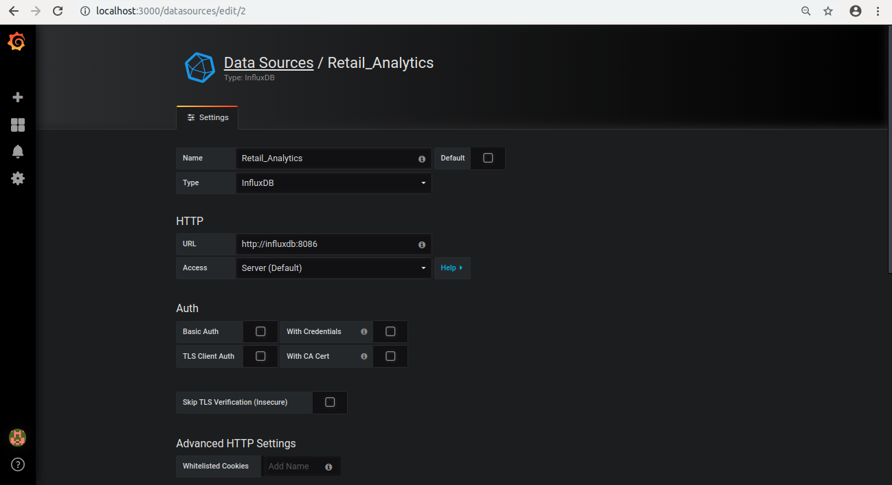
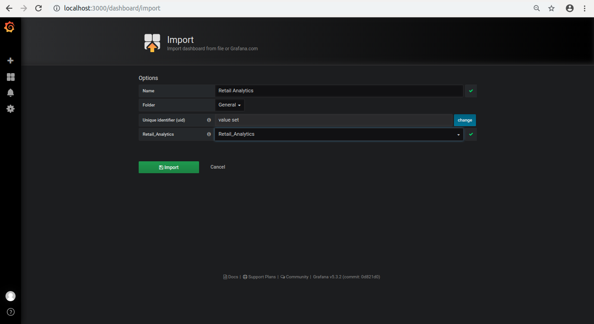
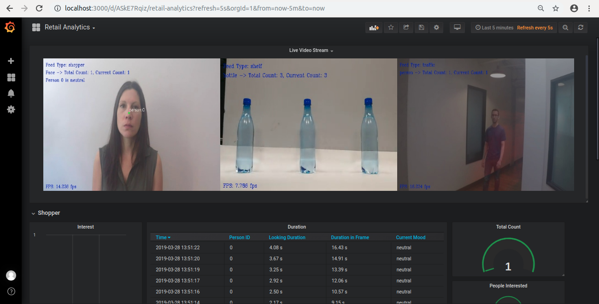

# Containerization 

## Install docker
To install docker, please refer the link: [https://docs.docker.com/install/linux/docker-ce/ubuntu/](https://docs.docker.com/install/linux/docker-ce/ubuntu/)<br>

### Install docker-compose
Install docker-compose using the commands below:
```
sudo curl -L "https://github.com/docker/compose/releases/download/1.24.0/docker-compose-$(uname -s)-$(uname -m)" -o /usr/local/bin/docker-compose
sudo chmod +x /usr/local/bin/docker-compose
```


## Containerize the Application
The application has three parts:
* OpenVINO application
* InfluxDB
* Grafana

Each part of the application will run in seperate container. 


To containerize the application:
1. Go to `Docker/DockerGrafanaInfluxKit`  directory present inside the retail analytics directory.

    ```
    cd docker/DockerGrafanaInfluxKit/
    ```

2. InfluxDB and Grafana containers are run using __docker compose__. Docker Compose tool is used to define and run multi-container docker application. Build the docker image for InfluxDB and Grafana and run the containers.
    ```
    docker-compose up
    ```

3. To run the OpenVINO application container, open a new terminal and go to `DockerOpenvino` directory , present inside `retail-analytics/docker`.
    ```
    cd DockerOpenvino
    ```

4. To run the Openvino application in a container, OpenVINO toolkit need to be present inside it. Download the Intel® Distribution of OpenVINO™ toolkit from [https://software.intel.com/en-us/openvino-toolkit](https://software.intel.com/en-us/openvino-toolkit)  and extract the package inside `DockerOpenvino` directory.<br>
Now, build the docker image with the name __retail-analytics__.
    ```
    docker build -t retail-analytics .
    ```

5. To run the retail-analytics container:
    ```
    docker run -p 5000:5000 -it --network dockergrafanainfluxkit_default -v $HOME/retail-analytics:/app retail-analytics
    ```
    After executing the above command the, it will run the retail-analytics container and open its shell.

    __Note:__  Replace $HOME in the above command with the path to the _retail-analytics_ directory.

6. In the `retail-analytics` container shell, run the application:
    ```
    python3 main.py -fm /opt/intel/openvino/deployment_tools/tools/model_downloader/Transportation/object_detection/face/pruned_mobilenet_reduced_ssd_shared_weights/dldt/face-detection-adas-0001.xml -pm /opt/intel/openvino/deployment_tools/tools/model_downloader/Transportation/object_attributes/headpose/vanilla_cnn/dldt/head-pose-estimation-adas-0001.xml -mm /opt/intel/openvino/deployment_tools/tools/model_downloader/Retail/object_attributes/emotions_recognition/0003/dldt/emotions-recognition-retail-0003.xml -om ./resources/FP32/mobilenet-ssd.xml -lb ./resources/labels.txt -l /opt/intel/openvino/inference_engine/lib/intel64/libcpu_extension_sse4.so -ip influxdb
    ```

7. To see the output of the application running in the container, configure the Grafana dashboard.

	* In your browser, go to [localhost:3000](http://localhost:3000).

	* Log in with user as **admin** and password as **admin**.

	* Click on **Configuration**.

	* Select **“Data Sources”**.

	* Click on **“+ Add data source”** and provide inputs below.

	   - *Name*: Retail_Analytics
	   - *Type*: InfluxDB
	   - *URL*: http://influxdb:8086
	   - *Database*: Retail_Analytics
	   - Click on “Save and Test”

  	  

	* Click on **+** icon present on the left side of the browser, select **import**.

	* Click on **Upload.json File**.

	* Select the file name __retail-analytics.json__ from retail-analytics directory.

	* Select "Retail_Analytics" in **Select a influxDB data source**. 

    	

	* Click on import.

    	
